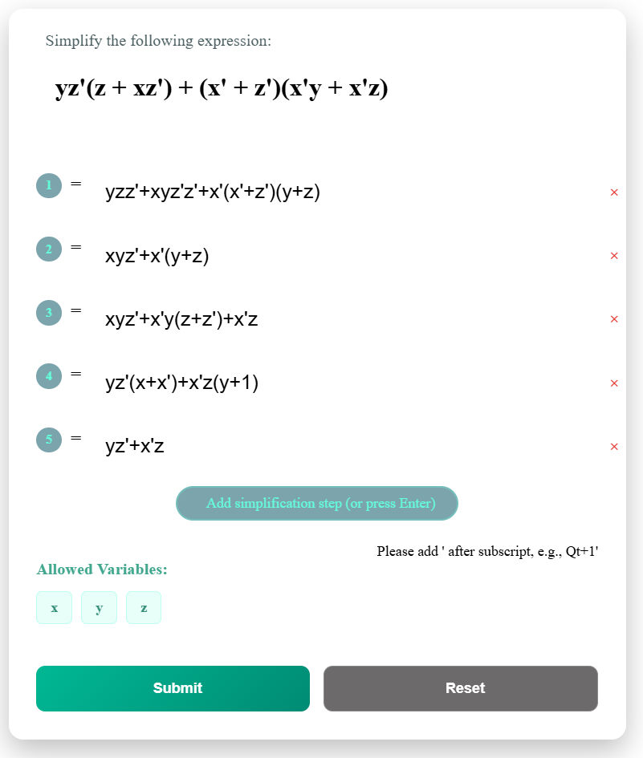
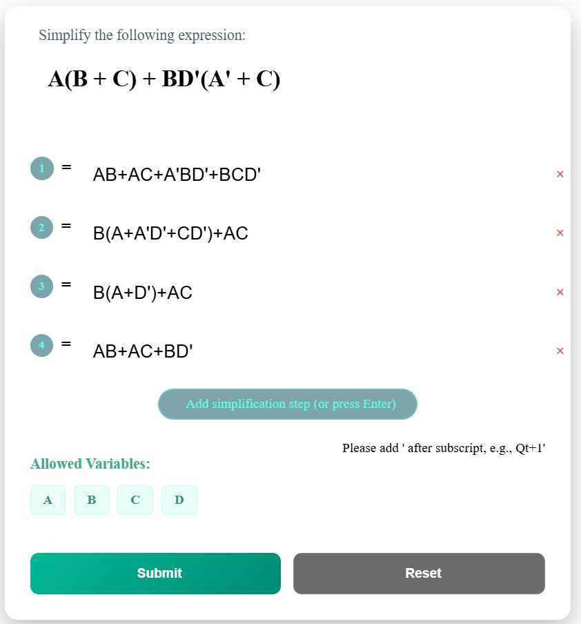
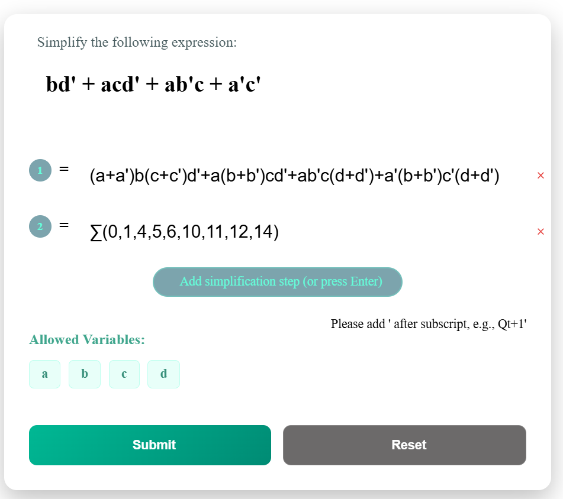
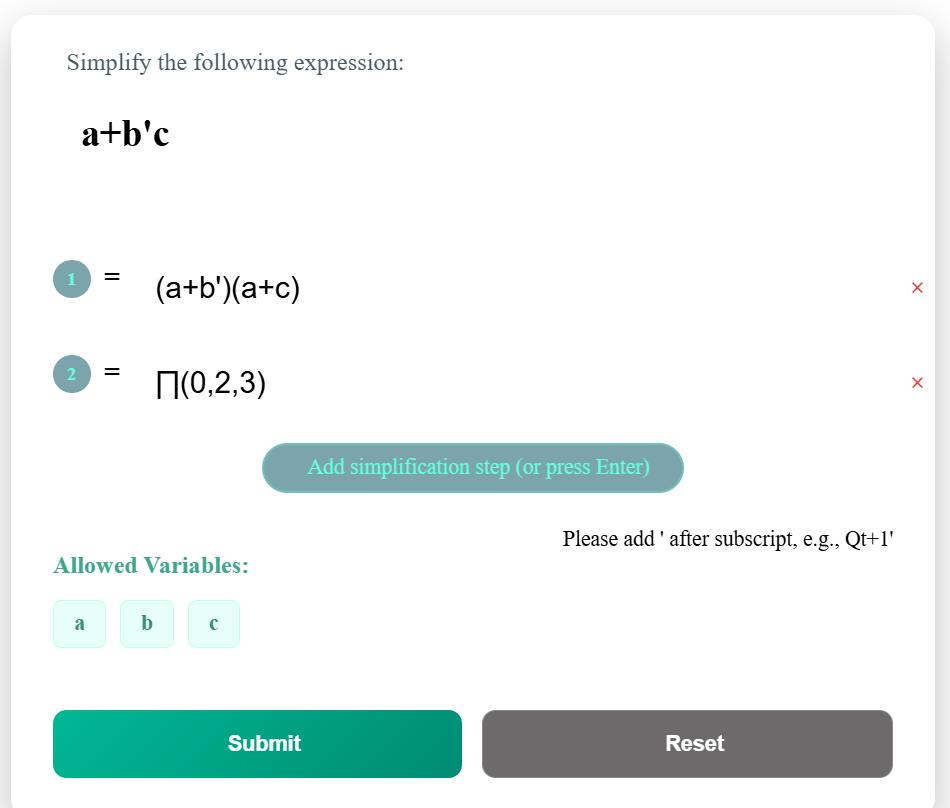
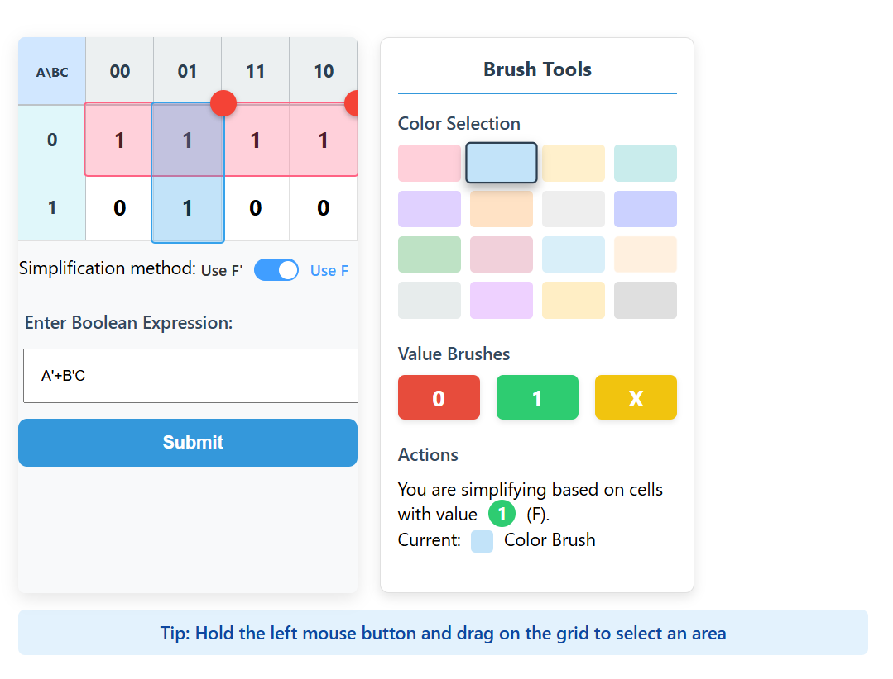
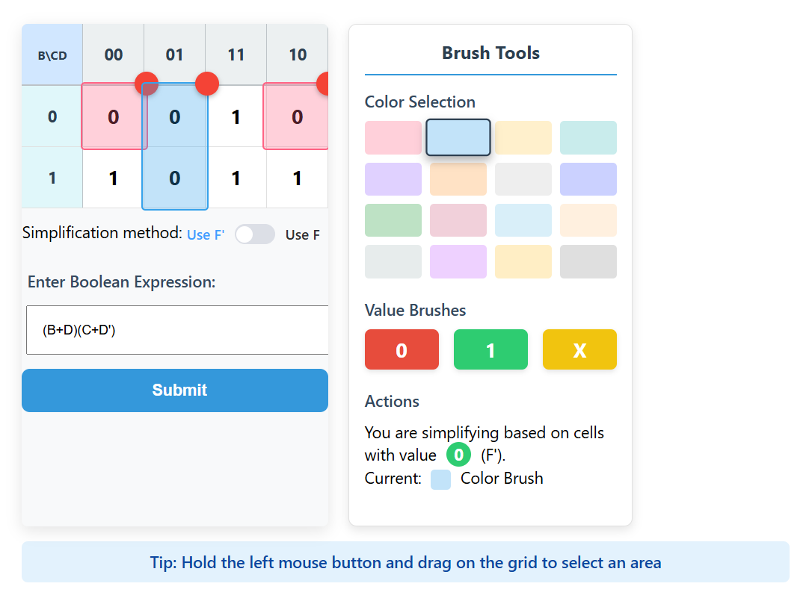
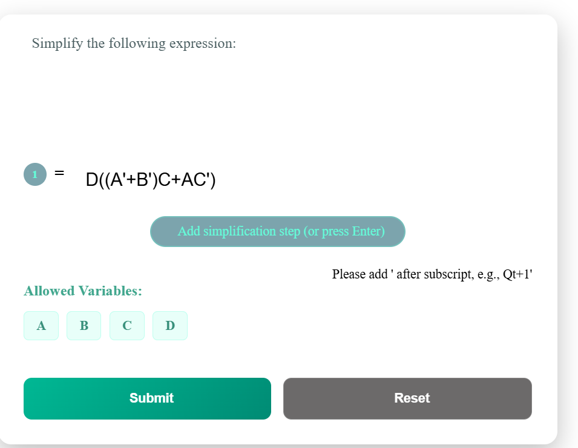
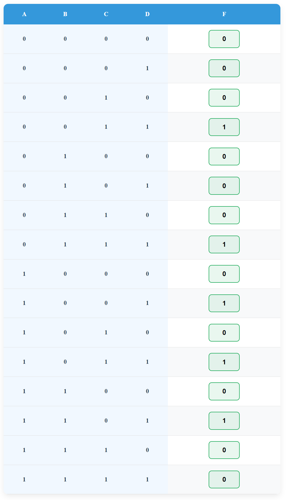
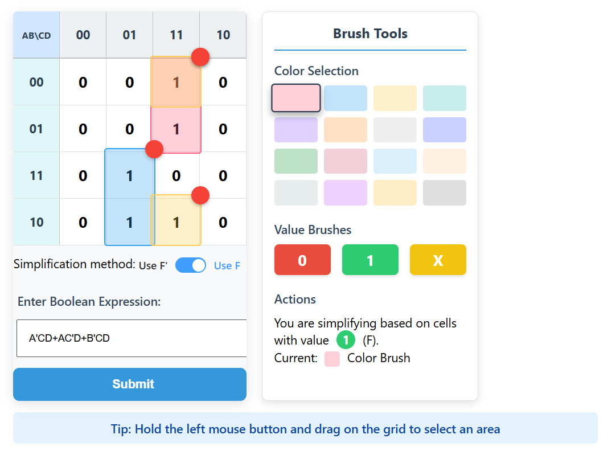
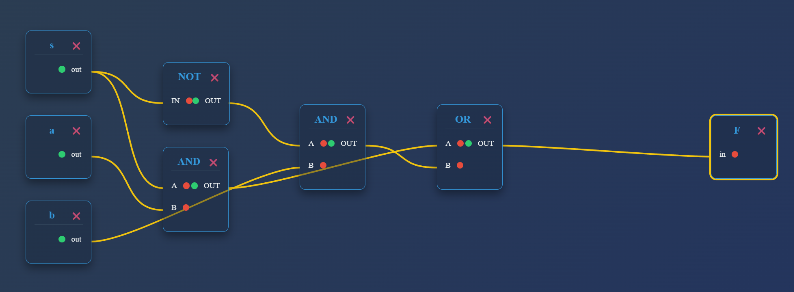

# Digital Logic - Assignment I

## 1. Convert the decimal number 123.4 to base 7, base 12, and base 16, retain maximum two digits after the radix point if necessary (no need to round).

234.25

A3.49

7B.66

## 2.Perform subtraction on the given unsigned numbers using the 10's complement of the subtrahend. Where the result should be negative, find its 10's complement and affix a minus sign.

The 10's complement of $2579$ is $10000 - 2579 = 7421$, then add them, $4637 + 7421 = 12058$, then drop the carry 1, the answer is $2058$.

The 10's complement of $1800$ is $10000 - 1800 = 8200$, then add them, $0125 + 8200 = 8325$, with no carry 1, and the 10's complement of $8325$ is $10000 - 8325 = 1675$, then the answer is $-1675$.

```
The 10's complement of $2579$ is $10000 - 2579 = 7421$, then add them, $4637 + 7421 = 12058$, then drop the carry 1, the answer is $2058$.
```

```
The 10's complement of $1800$ is $10000 - 1800 = 8200$, then add them, $0125 + 8200 = 8325$, with no carry 1, and the 10's complement of $8325$ is $10000 - 8325 = 1675$, then the answer is $-1675$.
```

## 3.Simplify the following Boolean expressions to a minimum number of literals using algebraic method:

### **yz'(z + xz') + (x' + z')(x'y + x'z)**



> **A(B + C) + BD'(A' + C)**



## 4.Express the Boolean expression bd' + acd' + ab'c + a'c' in sum of minterms form with Σ



## 5.Express the Boolean expression a+b'c in product of maxterms form with Π (The conversion with the help of sum of minterm form is not allowed)



## 6.Simplify the following three-variable Boolean functions algebraically to simplest standard form using K-map method:





## 7.For the following switch circuit:







##  8.Draw the circuit specified by the following HDL description



