# Digital Logic Notes

## Preface

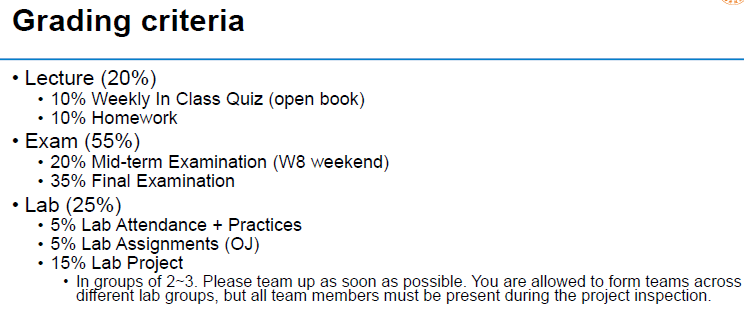

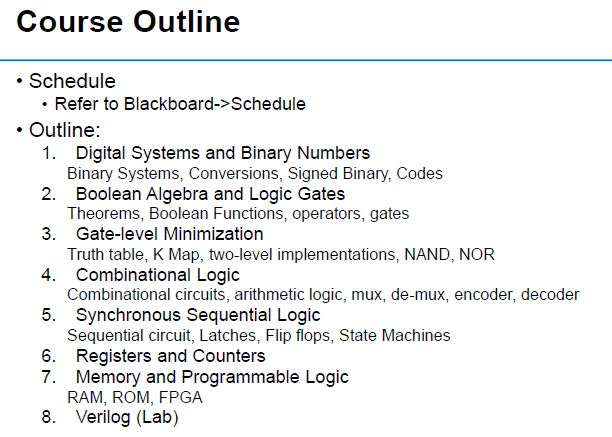

## I - Number System

### Conversion among Bases

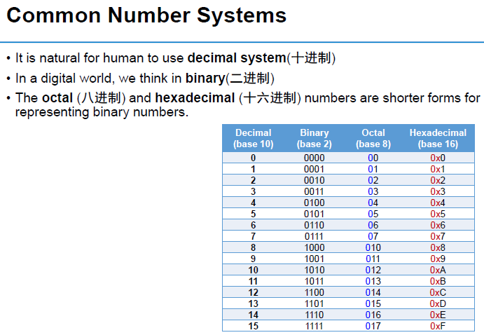

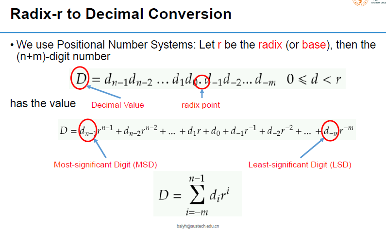

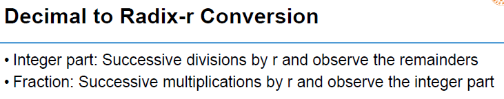

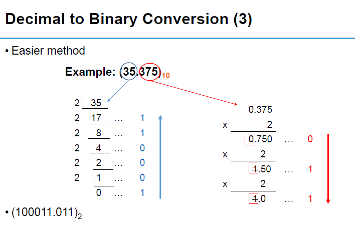

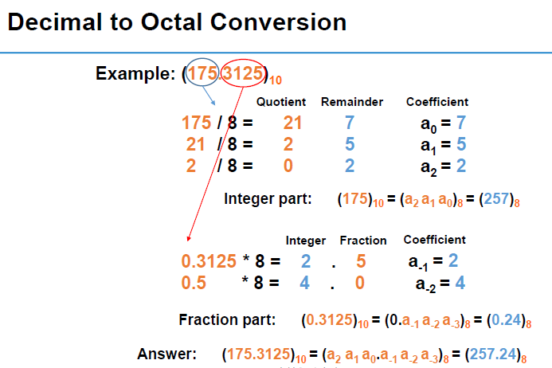

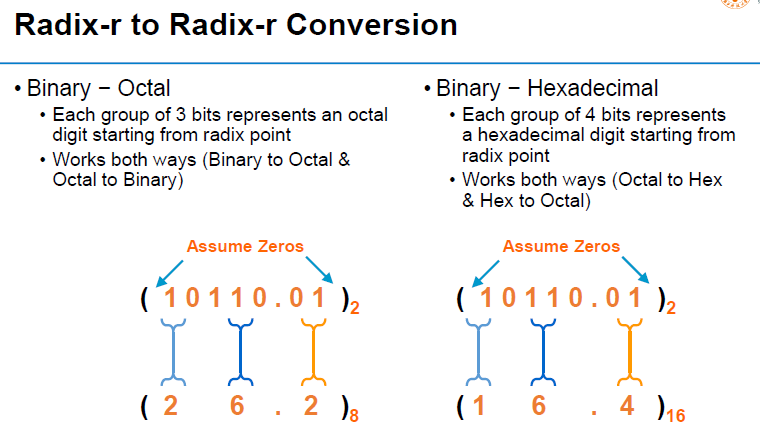

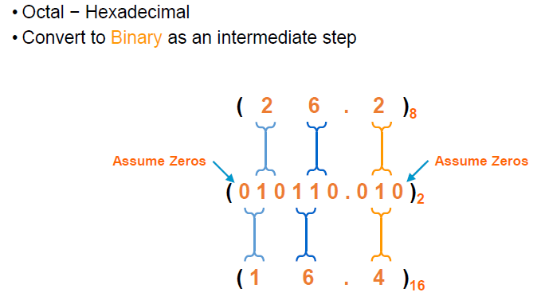

### Common Notions

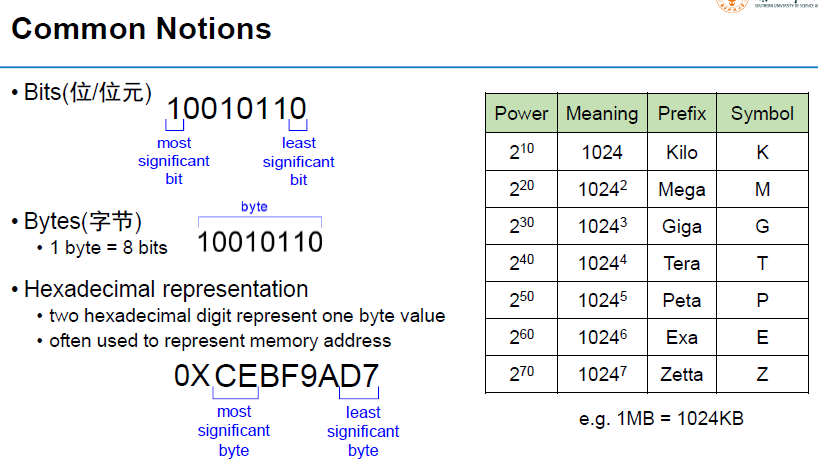

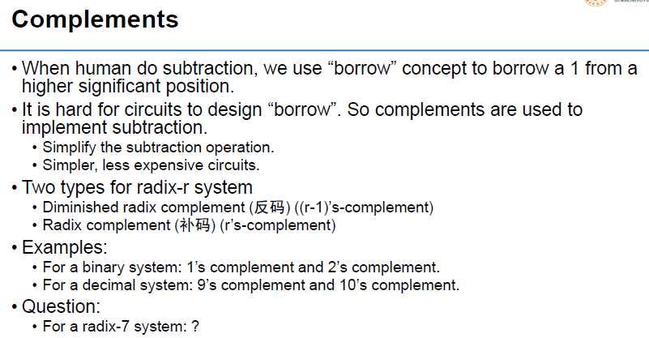

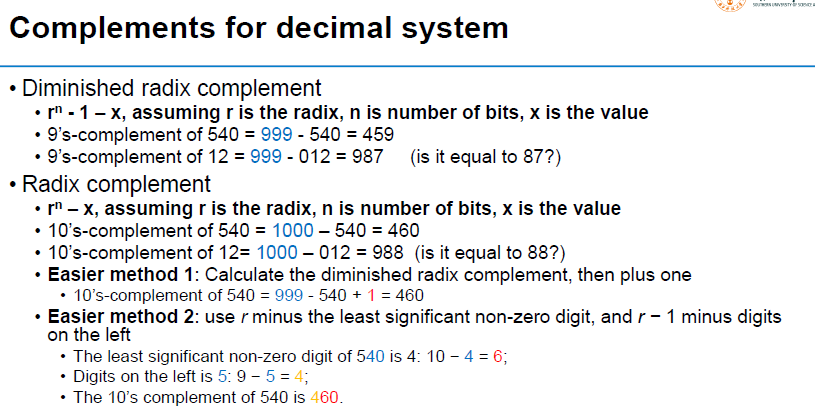

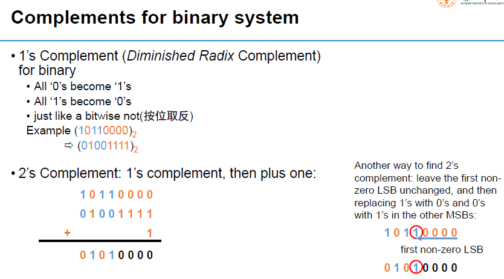

### Calculation

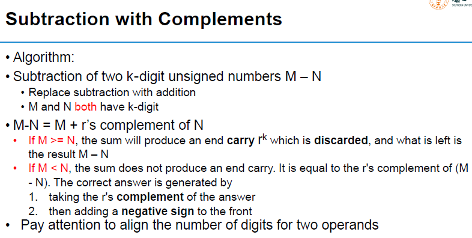

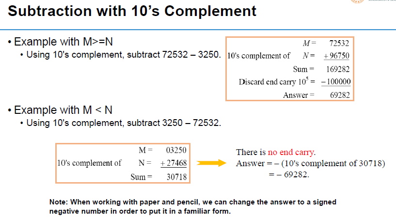

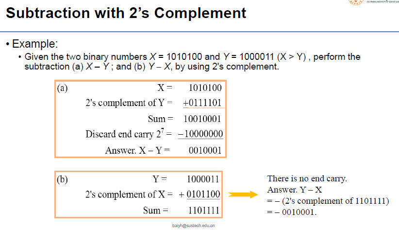

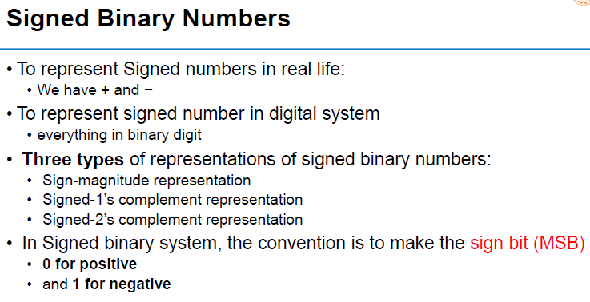

### Binary Codes Logic

#### BCD Codes

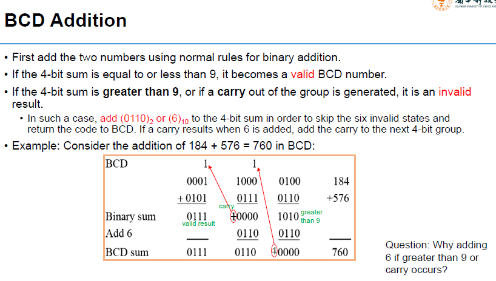

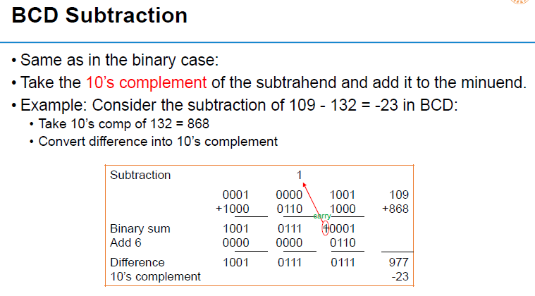

#### Gray Code

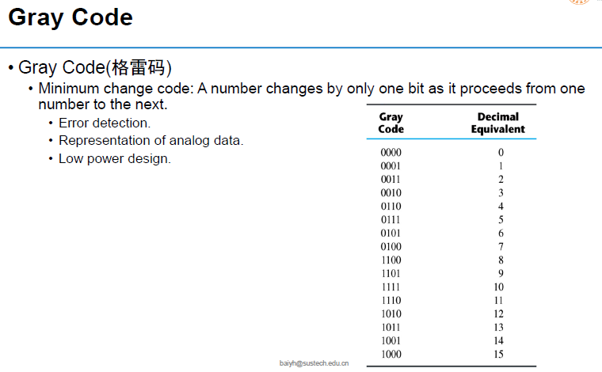

#### ASCII Codes

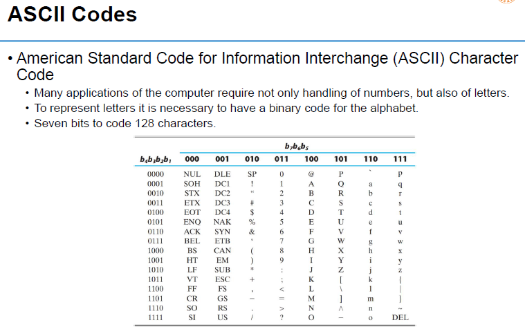

#### Error-Detecting Code

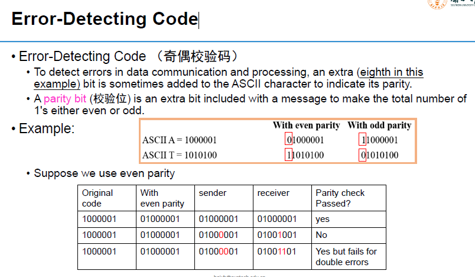

### Binary Logic

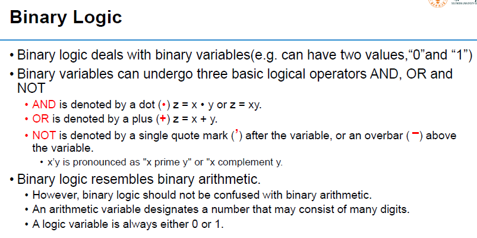
