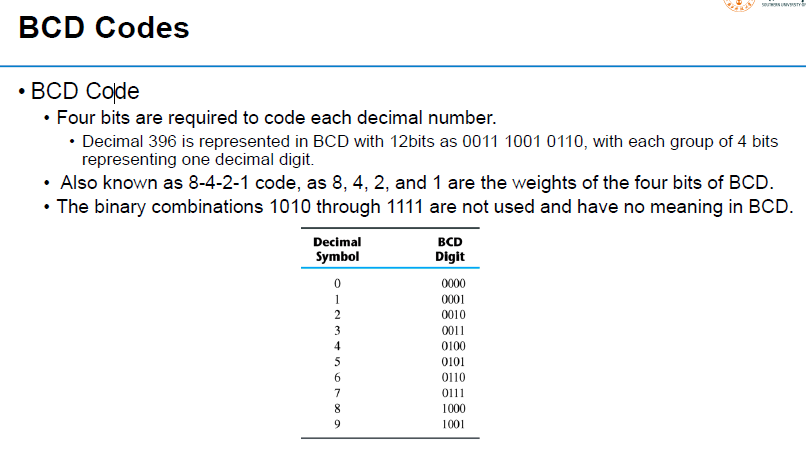

# Digital Logic Notes

## Preface

## I - Number System

### Conversion among Bases

### Common Notions

### Calculation

### Binary Codes Logic

#### BCD Codes

#### Gray Code

#### ASCII Codes

#### Error-Detecting Code

### Binary Logic

